# Yezi's Blog

个人博客：文章、想法（类朋友圈短内容）、作品集与评论。前后台一体，数据存放在本地 SQLite（`better-sqlite3`），无外部服务依赖。

- 前台：首页内容流、文章详情（Markdown 排版）、想法、作品、关于、评论（无感防垃圾、审核后展示、作者回复）、全站音乐播放器
- 后台：`/admin` 管理文章草稿与发布、分类、附件、想法、作品，以及评论审核、撤回和作者回复；站点设置可修改页头、页脚、Logo 与音乐播放器；可接入自建 QQ Music API 扫码登录并搜索选歌；文章编辑器支持引用公众号/网页文章
- SEO：全站 metadata、Open Graph、`sitemap.xml`、`robots.txt`、`rss.xml`

## 界面截图

截图使用本地生产模式生成，覆盖前台桌面端、前台手机端和后台手机端。后台截图中的仪表盘卡片、分类/标签管理、文章元信息、评论审核和站点设置均来自本地演示库。

### 前台桌面端

| 首页 | 文章详情 | 作品集 |
| --- | --- | --- |
| 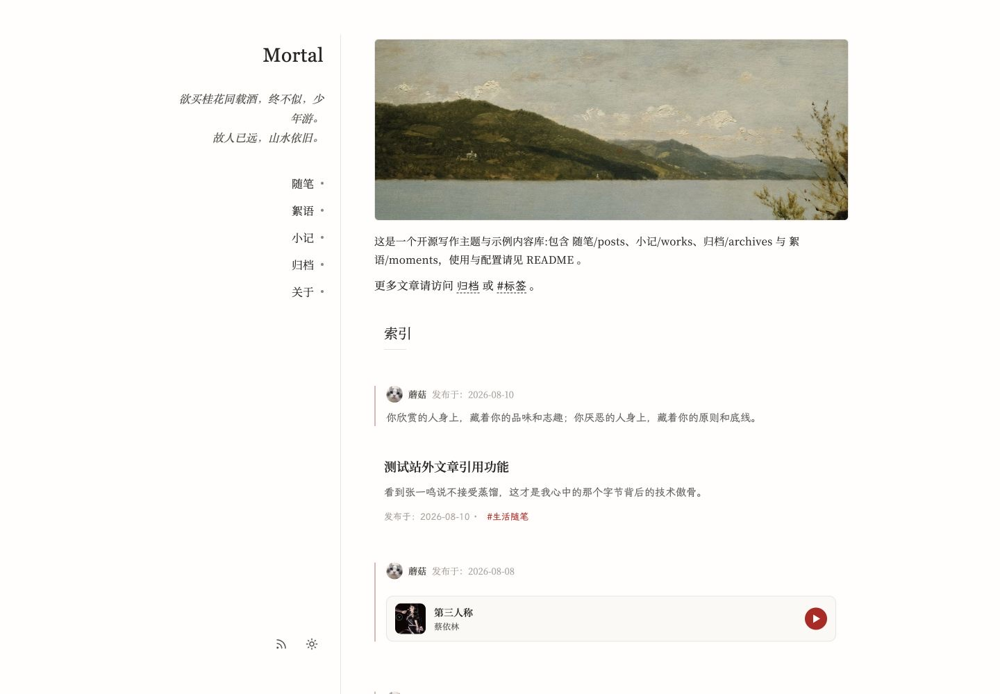 | 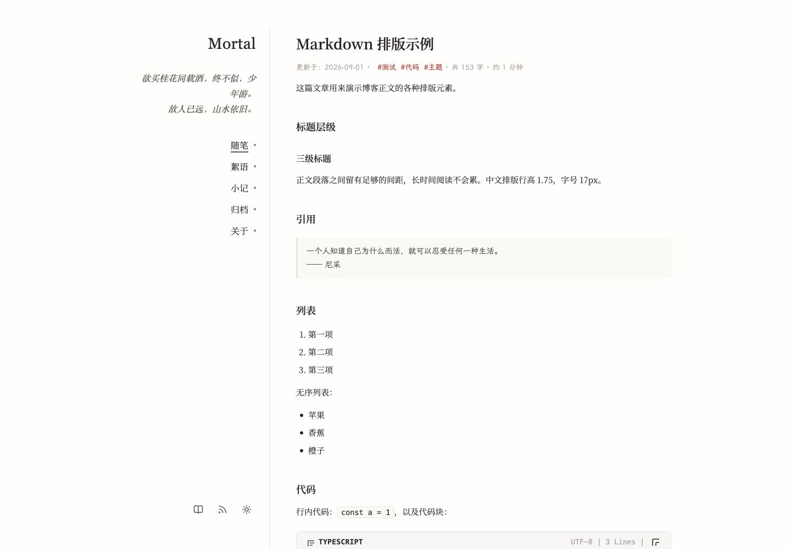 | 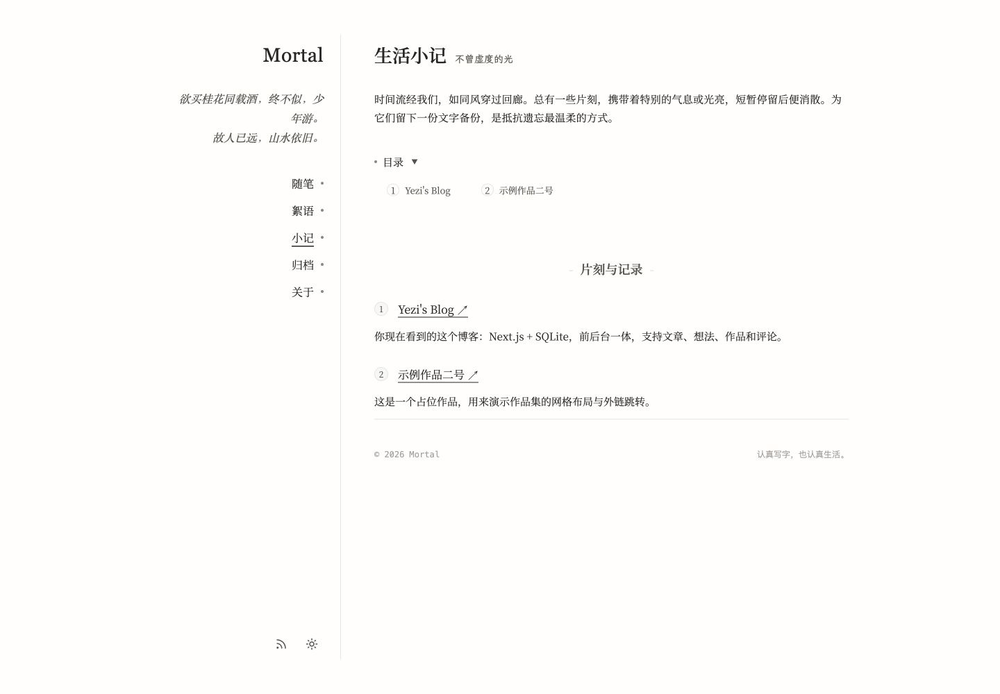 |

### 前台手机端

| 首页 | 文章详情 | 想法 | 作品集 |
| --- | --- | --- | --- |
| 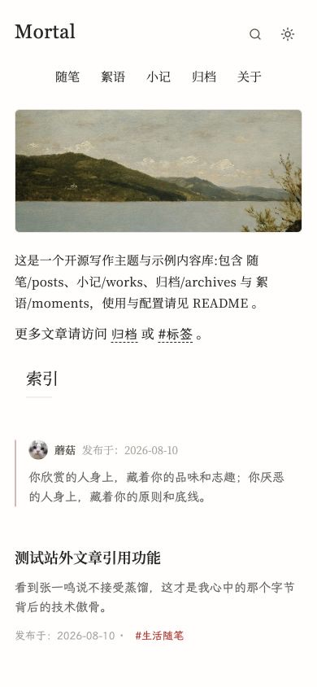 | 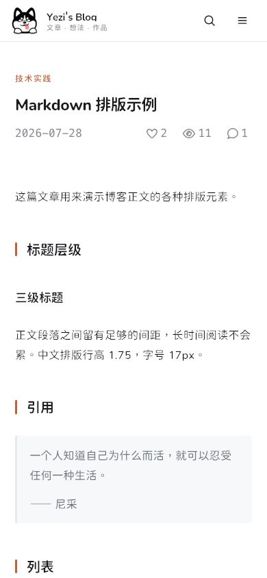 | 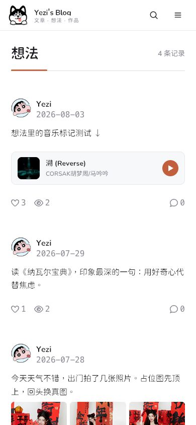 | 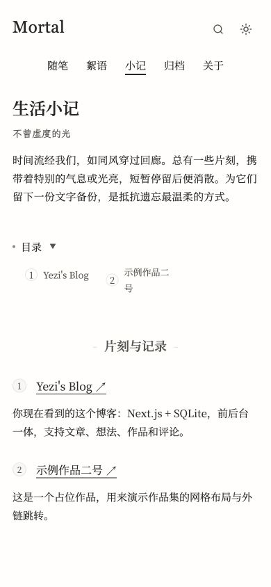 |

### 后台手机端

| 仪表盘 | 文章管理 | 想法管理 | 作品管理 |
| --- | --- | --- | --- |
| 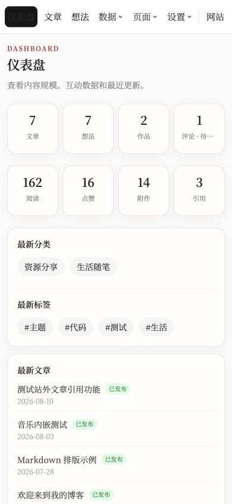 | 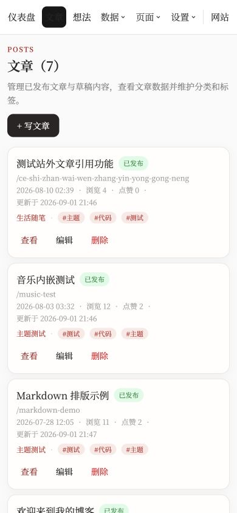 | 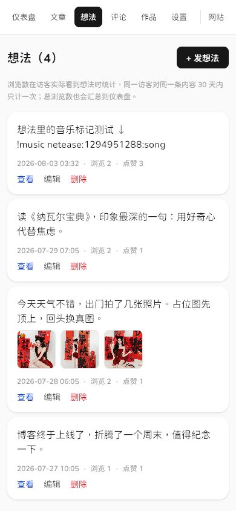 | 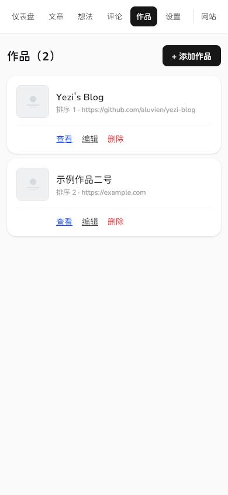 |

| 评论管理 | 分类与标签 | 站点设置 |
| --- | --- | --- |
| 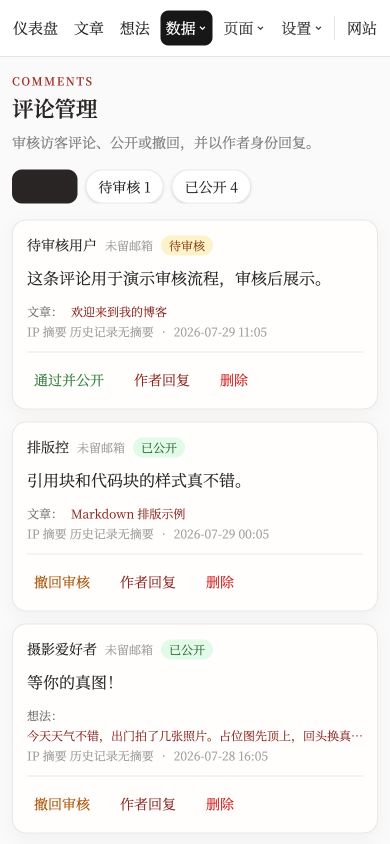 | 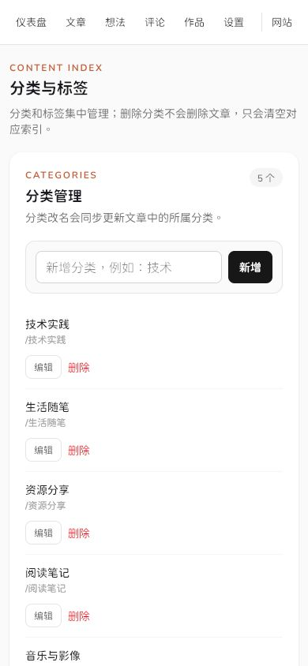 | 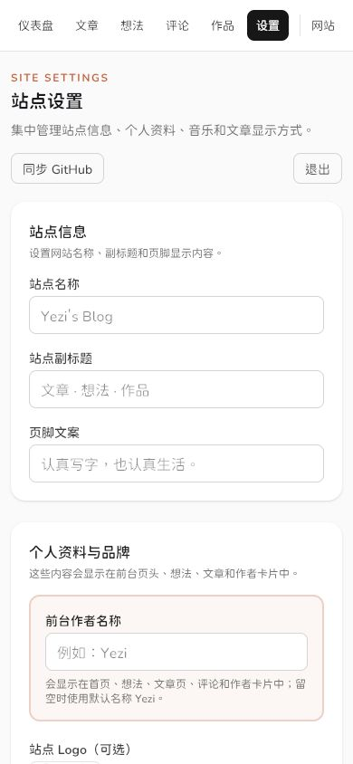 |

## 技术栈

Next.js 16（App Router）· React 19 · TypeScript · Tailwind CSS v4 · better-sqlite3 · marked

## 本地开发

```bash
npm ci
cp .env.local.example .env.local   # 修改 ADMIN_PASSWORD 等配置
npm run seed                       # 可选：写入演示数据（仅空库时生效）
npm run dev                        # http://localhost:3030
# 生产模式：先 npm run build，再 npm start
```

后台入口 `http://localhost:3030/admin`，密码为 `.env.local` 中的 `ADMIN_PASSWORD`。

管理员登录内置暴力破解保护：同一来源连续 5 次失败会锁定 15 分钟；全站账户在 15 分钟内累计 25 次失败也会锁定 15 分钟。只有在反向代理会覆盖客户端请求头、且 Node 端口不直接暴露公网时，才开启 `TRUST_PROXY=true`。

> 注意：直连访问（未配置 `X-Real-IP`/`X-Forwarded-For`）时，来源 IP 会被统一记为 `unknown`，所有此类访客共享同一评论限频与点赞去重键。生产环境务必通过反向代理提供 `X-Real-IP`，以保证限流按真实访客生效。

## 数据库升级与搜索索引

数据库会在首次打开时自动执行带版本号的 SQLite migration；升级在单个事务中完成，失败不会推进版本号或留下半完成状态。已有数据库无需手动导出、重建或修改表结构，仍请在部署前保留可恢复备份。

全文搜索使用 FTS5。启动时会校验索引版本、表结构、触发器、记录数和内容摘要；发现索引缺失、历史触发器故障或内容不一致时才会原子重建，正常启动不会无条件重建。上传图片的二进制文件不参与此校验。

评论限频仅保留来源 IP 的不可逆摘要；后台展示的“IP 摘要”用于定位频繁滥用来源，不保存新评论的明文 IP。

## 测试与质量检查

```bash
npm run lint
npm run typecheck
npm test                    # 全部单元与集成测试
npm run test:unit
npm run test:integration
npm run test:coverage         # Node 原生覆盖率基线
npm run benchmark:db          # 5,000 篇隔离数据库的查询计划与耗时基线
npx playwright install chromium  # 首次运行 E2E 时安装浏览器
npm run test:e2e
npm run build
npm run test:production       # 真实 standalone + SQLite/FTS/CSP smoke
```

Playwright、性能和 standalone 测试均使用独立的临时 SQLite 数据库和上传目录，不会修改本地开发数据。当前覆盖率基线为行 73.66%、分支 77.11%、函数 69.36%，CI 门槛分别为 70%、75%、65%；CI 还会执行高危依赖审计、standalone 与浏览器 smoke，并自动取消同一分支中过期的运行。

## 环境变量

见 `.env.local.example`：

| 变量 | 说明 | 默认值 |
| --- | --- | --- |
| `ADMIN_PASSWORD` | 后台登录密码 | 无（必填） |
| `ADMIN_API_TOKEN` | 可选的原生管理 API Bearer Token，至少 32 字符；轮换并重启即可撤销 | 空 |
| `NEXT_PUBLIC_SITE_URL` | 站点对外 URL，用于 metadata / sitemap / RSS，末尾不带斜杠 | `http://localhost:3030` |
| `BLOG_DB_PATH` | 可选的 SQLite 绝对路径，适合容器挂载或隔离测试 | `data/blog.db` |
| `API_CORS_ORIGIN` | 可选的 App/Web API 跨域来源；不设置时仅允许同源访问 | 空（同源） |
| `TRUST_PROXY` | 是否信任 Nginx/Cloudflare 覆盖后的 `X-Real-IP`、`X-Forwarded-For`；直连 Node 端口保持关闭 | `false` |
| `HOSTNAME` | Node 监听地址；PM2/裸机默认只监听回环，容器内需显式使用 `0.0.0.0` | `127.0.0.1` |
| `QQ_MUSIC_API_URL` | 自建 QQ Music API 的本机地址；后台扫码登录和 `qqvip` 音乐播放使用 | `http://127.0.0.1:3200` |
| `QQ_MUSIC_SESSION_PATH` | QQ 扫码会话文件路径；留空时放在数据库同目录，必须持久化且不可公开访问 | `data/qq-music-session.json` |
| `QQ_MUSIC_HEALTH_CHECK_MID` | 用于验证 QQ Cookie 真实播放授权的歌曲 MID；建议选择一首可稳定播放的歌曲 | 内置测试歌曲 |
| `QQ_MUSIC_SIGNING_KEY` | 歌词短时授权签名密钥，生产建议至少 32 个随机字符 | 进程临时密钥 |
| `DATA_BACKUP_KEY` | 完整数据归档的 32 字节 base64 AES-256-GCM 密钥 | 空（只做 DB 备份） |
| `DATA_BACKUP_MIRROR_DIR` | 可选的异机挂载/独立故障域镜像目录，不得放在 `BLOG_ROOT` 内 | 空 |
| `TELEGRAM_BOT_TOKEN` / `TELEGRAM_CHAT_ID` | 可选，Telegram Bot 通知凭据；用于新评论和 QQ 音乐状态提醒 | 空（不发送） |
| `TELEGRAM_ADMIN_USER_ID` | 推荐配置的管理员个人 User ID；管理命令、审核和 QQ 登录仅接受该用户的私聊操作 | 空（仅兼容通知 Chat ID 为管理员私聊的旧配置） |
| `LLM_API_KEY` / `OPENAI_API_KEY` | 可选，文章引用 AI 摘要服务的密钥；兼容 OpenAI Chat Completions 格式 | 空（不生成摘要） |
| `LLM_API_URL` | 可选，AI 摘要接口地址，可填服务商根地址、`/v1` 或完整的 Chat Completions 地址 | `https://api.openai.com/v1/chat/completions` |
| `LLM_MODEL` | 可选，AI 摘要模型名 | `gpt-4o-mini` |

## 音乐功能

文章和想法都可以嵌入音乐；前台由一个全站播放器统一接管，因此从文章或想法切换页面时不会中断播放。后台“设置 → 音乐设置”可以设置默认歌单、随机播放与播放器位置。

### 在文章和想法中插入

文章和想法都优先使用独占一行的短代码：

```text
!music qqvip:歌曲MID:song
!music qqvip:歌单ID:playlist
!video https://www.bilibili.com/video/BVxxxxxxxxxx
!video https://youtu.be/VIDEO_ID
```

旧文章中的 `music` Markdown 代码块仍保持兼容，一行一首或一个歌单：

````md
```music
qqvip:歌单ID:playlist
qqvip:歌曲MID:song
```
````

常规格式为 `平台:ID:类型[:random]`：

| 字段 | 可选值 / 说明 |
| --- | --- |
| 平台 | `qqvip` |
| 类型 | `song`、`playlist` |
| `random` | 可选；打乱歌单顺序 |

后台文章和想法编辑器的“+ 音乐”按钮也支持手动填写上述格式。

Bilibili 支持完整视频 URL、BV/av ID 和分 P 参数，YouTube 支持完整 URL 与视频 ID。`b23.tv` 不透明短链不会在公开渲染时联网展开；编辑器会明确提示先在浏览器中展开为完整 Bilibili 地址。

### QQ 音乐扫码登录、搜索与播放

项目可选接入 [sansenjian/qq-music-api](https://github.com/sansenjian/qq-music-api)，用于使用自己的 QQ 音乐账号扫码登录、在后台搜索歌曲，并由本站服务端获取播放地址。

接入后：

1. 在“设置 → 音乐设置”选择“使用手机 QQ 扫码”或“使用 QQ 音乐 App 扫码”。QQ 音乐 App 通道由博客 Node 进程直接连接 `u.y.qq.com` 与 `mu.y.qq.com`，不会修改或重启现有 QQ Music API 服务。
2. 扫码并确认；两种通道最终都把兼容 Cookie 保存在服务器的受限会话文件中，并仅通过本机请求头转给 QQ Music API。网站数据库、访客浏览器和 Telegram 均不会保存或收到 Cookie。
3. 在文章或想法编辑器点击“+ 音乐 → QQ 音乐搜索”，选择歌曲即可插入。
4. 插入的格式为 `qqvip:歌曲MID:song` 或 `qqvip:歌单ID:playlist`。前台播放时由本站 `/api/music/qq` 服务端接口临时解析播放地址，并带有限频保护。

当前音乐系统只使用 `qqvip`。请仅使用自己拥有合法播放权限的账号，并留意 QQ 音乐的服务规则；第三方接口或上游登录机制变化后，可能需要重新扫码登录。

## 文章引用

文章编辑器工具栏中的“文章引用”支持粘贴微信公众号或普通网页文章链接。后台服务端会读取网页公开的标题、来源、作者、日期、描述和封面，编辑器预览后将快照以紧凑标记写入正文；前台渲染时只使用文章内的快照，不会让每位访客再次请求第三方网页，因此不会拖慢文章首屏。后台仪表盘的“引用管理”页可以查看所有引用及其所在文章。

读取引用时默认会额外保存“私有阅读归档”：原始 HTML 以 gzip 形式写到 `data/reference-archives/`，并用 Readability 提取正文、移除导航/广告/脚本/推荐模块，再经严格 HTML 白名单清洗后保存到 SQLite。若配置 LLM，归档时会让 AI 从候选正文块中识别并排除无关文本，同时生成摘要和要点；模型只返回保留块编号，服务端从已清洗 HTML 重建正文，不使用模型输出的 HTML。正文图片默认也会下载到 `data/ref/<归档哈希>/`，阅读页仅通过管理员接口读取，因此原站防盗链或失效后仍可查看；单张图片下载失败时才降级使用本站代理。归档仅在管理员后台的“引用管理 → 阅读缓存”中可见，绝不会向访客公开全文；可随时从管理页更新正文或下载原始快照。请只归档自己有权保存的内容，并保留来源与原文链接。

引用卡片的标题可直接打开原文；如果配置了 `LLM_API_KEY` 或 `OPENAI_API_KEY`，后台会在读取元信息后自动尝试生成中文摘要和要点，摘要默认折叠显示。存在私有阅读归档时，AI 摘要优先使用本地归档正文，不会再次访问第三方网页。没有配置密钥时仍可正常使用普通引用卡片。

引用卡片快照保存在 SQLite 的 `article_references` 表中，私有阅读归档保存在 `article_reference_archives` 表与 `data/reference-archives/`。删除正文中的引用并保存文章时会同步清理卡片关联；阅读归档作为收藏保留，不会自动删除。

## App API

已提供版本化公开接口，基础地址为 `/api/v1`。接口只返回已发布文章、公开想法、作品、已审核评论和前台可见引用；不暴露邮箱、IP、后台设置或引用私有阅读归档。每个响应都带有 `X-API-Version: v1`，列表统一使用 `{ data, meta }`，`meta` 包含 `page`、`limit`、`total`、`total_pages`。

```text
GET /api/v1                 # 接口发现与版本信息
GET /api/v1/site            # 原生端需要的公开品牌、作者、导航、关于页 Markdown 与社交链接
GET /api/v1/posts           # 文章列表，支持 ?page=1&limit=20（limit 最大 50）
GET /api/v1/posts/:slug     # 文章详情、已审核评论和正文引用快照
GET /api/v1/moments         # 想法列表，支持分页
GET /api/v1/works           # 作品列表，支持分页
GET /api/v1/feed            # 文章与想法的统一时间流，支持分页
GET /api/v1/categories      # 分类列表，含已发布文章数 posts_count
GET /api/v1/tags            # 已发布文章标签与计数，支持 ?limit=50
GET /api/v1/references      # 公开引用卡片，支持 ?q=关键词&category=分类&page=1&limit=20
GET /api/v1/reference-categories # 公开引用分类与计数
GET /api/v1/search?q=关键词  # 搜索文章与想法，支持分页
GET /api/v1/interactions?target_type=post&target_id=1 # 阅读/点赞统计
POST /api/v1/interactions   # body: { target_type, target_id, kind: "view" | "like" }
POST /api/v1/comments       # 提交评论，沿用前台审核与限频规则
```

### 原生客户端使用约定

- `GET /posts?view=summary` 返回轻量文章卡片：包含 `excerpt`，不包含整篇 `content`。可与 `category`、`tag`、`page`、`limit` 组合使用；不带 `view=summary` 时仍保持原有完整文章返回，兼容既有调用方。
- 文章详情的 `content` 和 `site.about_content` 是 Yezi Markdown。若正文有 `!reference:<token>`，使用同一响应中的 `references` 快照渲染卡片；该数组只含公开元信息，绝不包含归档 HTML、原文快照路径或后台任务信息。
- `cover`、`logo`、`avatar`、想法图片等以站内相对 URL 返回，原生客户端应相对请求的站点根 URL 解析。引用列表与文章详情 `references` 均提供 `cover_url`，应优先使用它；它始终走本站受 SSRF 保护的图片代理。
- 纯原生 iOS 请求不受浏览器 CORS 限制，因此无需为 App 设置 `API_CORS_ORIGIN`。只有 WebView 或其他浏览器来源需要跨域时，才将该变量设为唯一可信来源。
- 点赞/阅读的 `POST /interactions` 可携带随机 UUID 请求头 `X-Yezi-Visitor-Id`。iOS 应首次启动生成 UUID 并存入 Keychain，不能使用账号、设备序列号、IDFA 或任何可识别个人信息。服务端只保存哈希；该头只影响互动去重，限频仍按来源网络与 User-Agent 执行。

所有新增字段和端点均保持在 `/api/v1` 内，不删除原字段或改变既有默认返回。需要破坏性变更时应新增 `/api/v2`。

## Admin REST API（原生 iOS 管理端）

网页后台继续使用 Server Actions；原生 App 应使用 `/api/admin/v1` 的 REST JSON 接口，不需要 WebView，也不能调用 Next.js Server Actions 协议。推荐在服务器配置独立的 `ADMIN_API_TOKEN`，原生客户端通过 `Authorization: Bearer <token>` 调用；令牌至少 32 字符，轮换环境变量并重启即可撤销，不能写入 URL、普通日志或前端代码。

网页 Cookie 模式只允许精确同源请求：写操作必须携带浏览器产生的同源 `Origin` 和 `X-Yezi-Csrf: 1`，并拒绝跨站、`Origin: null` 和 `text/plain`。无 Origin 的原生请求不要复用 Cookie，应使用 Bearer Token。所有路由失败时返回 JSON，不重定向到 HTML；响应带 `Cache-Control: private, no-store` 和 `X-API-Version: v1`。

成功响应：

```json
{ "data": {}, "meta": {} }
```

失败响应：

```json
{
  "error": {
    "code": "UNAUTHENTICATED",
    "message": "未登录或登录已过期"
  }
}
```

未登录固定为 HTTP `401`。所有列表支持 `page`、`limit`（最大 100），并在 `meta` 返回 `page`、`limit`、`total`、`totalPages`。

### 分类与标签

| 方法 | 路径 | 请求 JSON | `data` |
| --- | --- | --- | --- |
| GET | `/api/admin/v1/categories?page=1&limit=20` | — | 分类数组，每项含 `id`、`name`、`slug`、`created_at`、`posts_count` |
| POST | `/api/admin/v1/categories` | `{ "name": "分类名称" }` | 新分类（含 `posts_count`） |
| PATCH | `/api/admin/v1/categories/:id` | `{ "name": "新的分类名称" }` | 更新后的分类（含 `posts_count`） |
| DELETE | `/api/admin/v1/categories/:id` | — | `{ "id": 1 }` |
| GET | `/api/admin/v1/tags?page=1&limit=20` | — | `{ tag, count }` 数组 |
| PATCH | `/api/admin/v1/tags` | `{ "old_tag": "旧标签", "new_tag": "新标签" }` | `{ "tag": "新标签", "tags": [{ "tag": "新标签", "count": 2 }] }` |
| DELETE | `/api/admin/v1/tags` | `{ "tag": "要删除的标签" }` | `{ "tag": "旧标签", "tags": [] }` |

分类与标签名称均最长 80 字符；标签不能含英文逗号、中文逗号或换行。重复分类、无效参数均为 HTTP `400`，不存在的分类/标签为 HTTP `404`。标签变更会更新现有文章标签关系；当前想法数据模型不含独立标签字段。

### 引用资料库

`GET /api/admin/v1/references?page=1&limit=20&search=&category=&tag=` 返回后台完整引用字段：

```json
{
  "data": [{
    "id": 1,
    "url": "https://example.com/article",
    "canonical_url": "https://example.com/article",
    "title": "文章标题",
    "source_name": "来源",
    "author": "作者",
    "published_at": "2026-08-21",
    "cover_url": "https://example.com/cover.jpg",
    "description": "描述",
    "summary": "摘要",
    "key_points": ["要点"],
    "category": "阅读",
    "tags": ["iOS"],
    "archive_captured_at": null,
    "archive_updated_at": null,
    "archive_cache_report": null,
    "linked_post_count": 1,
    "linked_post_titles": ["关联文章"],
    "created_at": "2026-08-21T00:00:00.000Z",
    "updated_at": "2026-08-21T00:00:00.000Z"
  }],
  "meta": { "page": 1, "limit": 20, "total": 1, "totalPages": 1 }
}
```

| 方法 | 路径 | 请求 JSON | `data` |
| --- | --- | --- | --- |
| GET | `/api/admin/v1/references/:id` | — | 上述单个完整引用 |
| POST | `/api/admin/v1/references` | `{ "snapshot": { "url": "…", "canonicalUrl": "…", "title": "…", "source": "…", "author": "…", "publishedAt": "…", "cover": "…", "description": "…", "summary": "…", "keyPoints": [] }, "category": "阅读", "tags": "iOS, REST" }` | 保存后的完整引用 |
| PATCH | `/api/admin/v1/references/:id` | `{ "category": "阅读", "tags": "iOS, REST" }` | 更新后的完整引用 |
| DELETE | `/api/admin/v1/references/:id` | — | `{ "id": 1 }` |
| POST | `/api/admin/v1/references/bulk-delete` | `{ "ids": [1, 2, 3] }` | `{ "deletedCount": 3 }` |
| POST | `/api/admin/v1/posts/:id/references` | `{ "snapshot": { /* ArticleReferenceSnapshot */ } }` | 更新后的完整文章，含 `referenceSnapshots` |

该管理接口不会返回阅读归档正文、原始 HTML 或归档文件路径；归档操作仍沿用既有 `/api/admin/article-references/*` 管理接口。

### 附件维护

| 方法 | 路径 | 请求 JSON | `data` |
| --- | --- | --- | --- |
| POST | `/api/admin/v1/attachments/:id/compress` | `{ "profile": "balanced" }`（也可为 `quality`、`small`） | `{ "originalSize": 1024, "compressedSize": 800, "savedPercent": 22, "changed": true }` |
| POST | `/api/admin/v1/attachments/untracked/compress` | `{ "path": "202608/file.png", "profile": "balanced" }` | 同上，另含规范化的 `path` |
| POST | `/api/admin/v1/attachments/cleanup-unused` | `{ "confirm": true }` | `{ "deletedCount": 2, "skippedCount": 0 }` |
| DELETE | `/api/admin/v1/attachments/untracked` | `{ "path": "202608/file.png", "confirm": true }` | `{ "path": "/uploads/202608/file.png", "deletedCount": 1, "skippedCount": 0 }` |

`path` 必须相对 `uploads` 目录，任何 `..`、绝对目录或 uploads 外路径都将返回 HTTP `400`。删除与清理必须显式传入 `confirm: true`；正在文章、想法或站点设置中使用的附件不会被删除。

### GitHub 同步与部署

这些端点没有可传参数：客户端提交命令、路径、PM2 进程名或分支都会被拒绝。服务器仍只会使用预配置的部署目录、`main` 分支、既有锁文件和状态文件。

| 方法 | 路径 | 请求 JSON | `data` |
| --- | --- | --- | --- |
| GET | `/api/admin/v1/deploy/status` | — | `{ "status": "unknown" \| "queued" \| "building" \| "switching" \| "checking" \| "rolling_back" \| "success" \| "failed", "updatedAt": "…", "error": "…" }` |
| GET | `/api/admin/v1/deploy/version` | — | `{ "status": "up-to-date" \| "outdated" \| "dirty" \| "unavailable", "localCommit": "…", "remoteCommit": "…" }` |
| POST | `/api/admin/v1/deploy/sync` | `{}` 或无 body | `{ "status": "success", "message": "…" }` |
| POST | `/api/admin/v1/deploy/restart` | `{}` 或无 body | 已禁用独立重启；部署只能通过受健康检查和回滚保护的同步状态机执行 |

重复同步返回 HTTP `409` 与 `DEPLOY_IN_PROGRESS`；失败返回统一 `error` envelope。API 与网页端同步按钮使用同一套固定的 `DEPLOY_PROJECT_DIR`、`DEPLOY_PM2_NAME`、部署锁及状态文件配置，不接受客户端传入命令、路径、分支或进程名。

## 数据与上传文件

- SQLite 数据库：`data/blog.db`（首次运行自动建表）
- 后台上传：`data/uploads/`
- 引用阅读归档与图片：`data/reference-archives/`、`data/ref/`
- QQ/Telegram 本地状态：`data/qq-music-session.json`、`data/telegram-bot-state.json`

整个 `data/` 都必须持久化。`npm run backup` 生成 SQLite online snapshot，并执行 `integrity_check`、`foreign_key_check` 与核心表校验。配置 `DATA_BACKUP_KEY` 后，自动任务和 `npm run backup:data` 还会生成 AES-256-GCM 加密的完整归档；归档包含一份经过校验的 DB snapshot、上传、引用归档和本地状态，明确排除在线 `blog.db-wal`/`blog.db-shm` 与备份目录。`DATA_BACKUP_MIRROR_DIR` 应指向异机挂载或独立故障域；程序拒绝把它放进 `BLOG_ROOT`。备份目录不得暴露到 Web，密钥不得写进 Git 或日志。

恢复演练或实际恢复前，先校验目标文件：

```bash
npm run backup:verify -- /absolute/path/to/blog-YYYYMMDDHHMMSS.db
npm run backup:data:verify -- /absolute/path/to/data-YYYYMMDDHHMMSS-xxxxxxxx.tar.gz.enc
```

恢复必须先在隔离目录验证归档和数据库，再进入维护窗口停止 PM2。恢复顺序为：保留当前状态副本；解密完整归档；将 `data/blog.db`、`uploads`、引用归档和约定的本地状态恢复到稳定 `BLOG_ROOT/data`；确认文件权限为目录 `0700`、敏感文件 `0600`；最后启动服务并检查 `/api/health/deploy`、文章图片和引用 reader。不要把在线 WAL/SHM 复制进恢复结果。真实异机上传、远端保留删除和恢复演练必须先由运维者明确目标与范围。

修改 `ADMIN_PASSWORD` 时，在同一维护窗口运行 `npm run auth:revoke-all`，然后重启并验证旧 Cookie 失效、新密码可登录；只改环境变量不会自动撤销已签发的会话。

## 演示数据

```bash
npm run seed
npm run demo:taxonomy
```

`npm run seed` 会插入 2 篇文章、3 条想法、2 个作品和几条评论；它会先检查表是否为空，非空则直接跳过，不会污染已有数据。

`npm run demo:taxonomy` 会幂等地补充技术实践、阅读笔记、音乐与影像等分类，并为演示文章写入 Next.js、Markdown、音乐、摄影等标签。它不会删除或覆盖想法、作品、评论和音乐设置，重复执行也不会生成重复分类。README 截图使用的本地数据包括 6 篇文章、4 条想法、2 个作品、5 条评论、5 个分类和 15 个标签；`data/` 与上传文件目录被 `.gitignore` 忽略，实际部署时请在目标环境单独初始化和持久化数据库。

## 生产部署

### 方式一：PM2 + Nginx（VPS）

```bash
npm ci
npm run build
pm2 start ecosystem.config.js   # standalone server，端口 3030
pm2 save && pm2 startup         # 开机自启
```

后台“同步 GitHub”会把 `origin/main` 构建到独立的版本化 Git worktree，使用回环临时端口完成健康、首页 CSP/commit 和真实 JS chunk 检查，再停止旧进程、建立经校验的 SQLite 快照、原子切换 `current` 软链并启动新 release。最终健康失败时会先恢复与旧 release 匹配的数据库快照，再切回旧代码。浏览器不会再额外触发第二次 PM2 重启。

生产环境应把 `BLOG_ROOT`、`BLOG_DB_PATH` 和 `BLOG_ENV_FILE` 放在 release 之外的稳定目录；`BLOG_ENV_FILE` 权限必须为 `0600`。同时设置固定的 `DEPLOY_PM2_NAME`，并按 `.env.local.example` 配置 `DEPLOY_RELEASES_DIR`、`DEPLOY_CURRENT_LINK` 等路径。部署前置检查会在拉代码前确认 PM2 进程、环境文件权限和互斥锁，避免误管其他 PM2 namespace。

如果没有设置 `BLOG_DB_PATH`，程序会固定使用项目根目录下的 `data/blog.db`；`start-standalone.mjs` 会在 PM2 工作目录变化时仍把默认路径指回项目根目录。若数据库放在项目外部，再显式填写绝对路径。

生产构建命令已固定使用 Next 的 webpack 路径（`npm run build`），适合宝塔/PM2 的非交互部署。PM2 进程的工作目录必须是项目根目录，且建议设置 `DEPLOY_PM2_NAME=yezi-blog`；未设置时程序会按 PM2 的 `pm_cwd` 自动查找同目录进程。

PM2/裸机默认 `HOSTNAME=127.0.0.1`，操作系统防火墙和安全组也应阻断公网 3030。站点放在 Nginx 后面时设置 `TRUST_PROXY=true`，并确认 Nginx覆盖而不是拼接客户端传入的 `X-Real-IP` / `X-Forwarded-For`。若确实直连 Node，则保持 `TRUST_PROXY=false`；容器内部显式监听 `0.0.0.0`，但 Docker 只把宿主端口映射到 `127.0.0.1`。

Nginx 反向代理示例见 `deploy/nginx.conf.example`。文件上限为 20 MiB、应用 multipart 请求上限 21 MiB、Next Proxy/Nginx 上限 22 MiB；公开入口必须经过 Nginx，由其在缓冲完整请求前拒绝超限上传。上线后把 `NEXT_PUBLIC_SITE_URL` 改为正式域名并重新 build。

### 可选：部署 QQ Music API（宝塔 / PM2）

QQ Music API 应作为博客之外的本机服务运行，**不要**放在博客 Git 工作目录中，避免博客同步代码时影响它的依赖或登录态。以下示例适用于宝塔面板已安装 Node.js 22 和 PM2 的服务器：

```bash
mkdir -p /www/wwwroot/services
cd /www/wwwroot/services
git clone https://github.com/sansenjian/qq-music-api.git
cd qq-music-api
npm ci
npm run build

PORT=3200 PM2_HOME=/root/.pm2 pm2 start npm \
  --name qq-music-api \
  --cwd /www/wwwroot/services/qq-music-api \
  -- run start
PM2_HOME=/root/.pm2 pm2 save
```

确认服务可用：

```bash
curl http://127.0.0.1:3200/getHotkey
```

博客默认连接 `http://127.0.0.1:3200`，无需额外配置；若服务端口不同，在博客 `.env.local` 中设置：

```bash
QQ_MUSIC_API_URL=http://127.0.0.1:3201
```

安全要求：

- 不要在宝塔防火墙开放 `3200`，也不要为这个 API 单独绑定公网域名。
- 只让博客服务通过 `127.0.0.1` 调用 QQ Music API；扫码、Cookie 查询和搜索接口均由博客后台管理员权限保护。
- `data/qq-music-session.json` 是登录会话文件，权限应为 `600`；它与 `blog.db` 一样需要保留在持久化目录，但绝不能提交到 Git 或暴露为静态文件。
- `data/qq-music-native-device.json` 是 QQ 音乐 App 扫码使用的稳定设备信息，同样只保存在服务器并由完整数据备份加密归档；该功能不要求修改或升级 3200 端口的现有服务。
- 更新此服务时只在它自己的目录执行 `git pull --ff-only`、`npm ci`、`npm run build`、`pm2 restart qq-music-api --update-env`；不要把 QQ Cookie 或其配置文件提交到博客仓库。

### 可选：Telegram 管理员提醒

在博客服务器的 `.env.local` 配置 `TELEGRAM_BOT_TOKEN` 与 `TELEGRAM_CHAT_ID` 后，重启博客服务。建议额外配置你的个人 `TELEGRAM_ADMIN_USER_ID`：管理命令、评论审核和 QQ 登录二维码只接受该用户的私聊操作；若通知发到群组，群组仅接收通知而不会出现高权限按钮。后台“设置 → 音乐设置”会显示通知配置状态，可发送测试消息，也可手动检测一次 QQ 音乐真实播放授权。

新评论会即时推送到 Telegram（不含评论者邮箱和 IP），QQ 音乐 Cookie 缺失、失效或本机服务不可用时会提醒；同一故障最多每 24 小时重复一次，恢复后会再发一条恢复通知。

QQ 音乐检测由博客 Node 进程内置调度：服务启动后会先检测一次，之后按后台设置的 1 / 6 / 12 / 24 小时间隔运行。保存设置后调度即时刷新，PM2 重启后也会自动恢复；无需宝塔计划任务、外部 `curl` 或额外密钥。当前实现适用于单实例 PM2 部署。

Bot 还会在同一 Node 进程中每约 3 秒读取一次管理员指令，不需要公网 Webhook。服务启动时会自动注册 Telegram 原生命令菜单：

- `/dashboard`：文章、想法、作品、附件、引用与待审评论概览；
- `/comments`：列出最近待审评论，并直接通过或回复并通过；
- `/qqstatus`：真实检查 QQ 音乐播放授权；
- `/qqlogin`：接收手机 QQ 授权二维码，扫码成功后自动保存登录会话；
- `/qqmusiclogin`：接收 QQ 音乐 App 原生二维码，扫码成功后自动保存兼容 Cookie；
- `/cancel`：取消正在进行的 QQ 登录或评论回复。

音乐异常通知内也有同样的二维码按钮。后台“设置 → Telegram 通知”可单独关闭新评论推送；内容编辑、删除和部署同步仍保留在网页后台，避免在消息里误操作。

### 方式二：Docker（standalone 输出）

项目已配置 `output: 'standalone'`，`Dockerfile` 为多阶段构建：

```bash
docker build --build-arg NEXT_PUBLIC_SITE_URL=https://your-domain.com -t yezi-blog .
docker run -d --name yezi-blog -p 3030:3030 \
  -v blog-data:/app/data \
  yezi-blog
```

注意：

- `better-sqlite3` 是原生模块，镜像内编译，请勿跨平台直接拷贝 `node_modules`。
- `/app/data`（数据库、上传、引用归档和本地状态）必须整体挂卷持久化，否则容器重建后数据丢失。
- `NEXT_PUBLIC_SITE_URL` 是构建期内联变量，务必在 `docker build` 时用 `--build-arg` 注入正式域名（见上方示例），否则镜像内为空、SEO 绝对链接会失效；改域名需要重新构建镜像。
